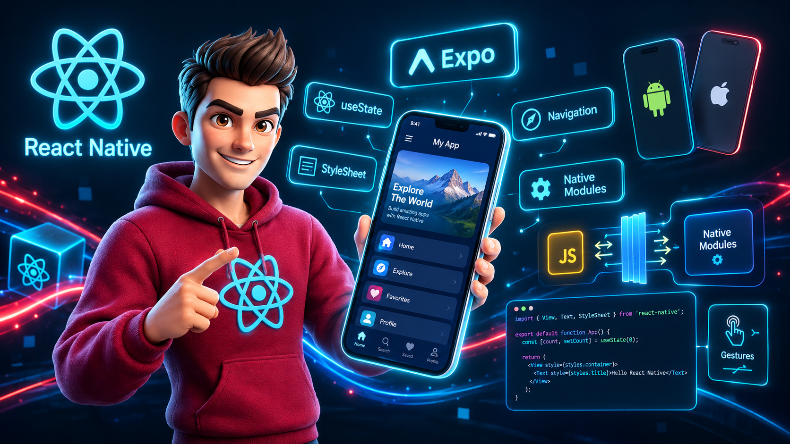

<h1 align="center">
&#x20; ReactNative-Playground 📱
</h1>

<p align="center">
&#x20; A hands-on playground for learning React Native with Expo, building cross-platform mobile applications, and experimenting with modern mobile development concepts.
</p>

<div align="center">
&#x20; 
</div>

---

## 🔋 Contents

This repository contains notes, examples, experiments, and small projects covering different areas of React Native and Expo development.

- ⚛️ React Native fundamentals and core concepts
- 🚀 Expo setup and development workflows
- 🧩 Reusable UI components and layouts
- 🧭 React Navigation and Expo Router
- 🔄 Props, State, Context, and Hooks
- 📝 Forms and form handling
- 💾 Local storage and offline support
- 🗄️ SQLite and local data persistence
- 🌐 Networking and backend integration
- 📱 Camera and media handling
- 🏃 Sensors and motion with Expo
- 📲 Device and system APIs
- 🧭 Location and Maps
- 🔔 Expo Notifications
- 🔐 Authentication
- 🚀 Expo Application Services (EAS)
- 📦 Building and publishing apps
- 🤖 AI-powered mobile applications
- 🌤️ Weather and API-based applications
- 🛠️ Hands-on projects and experiments

---

## 🎯 Purpose

To gain practical experience with React Native and Expo through hands-on projects, experiments, and exploration of modern mobile development concepts.

---

## 🤸 Getting Started

Clone the repository:

```bash
git clone https://github.com/soumadip-dev/ReactNative-Playground.git
cd ReactNative-Playground
```

Navigate to the project you want to run, install the dependencies, and start the Expo development server:

```bash
npm install
npx expo start
```

---
